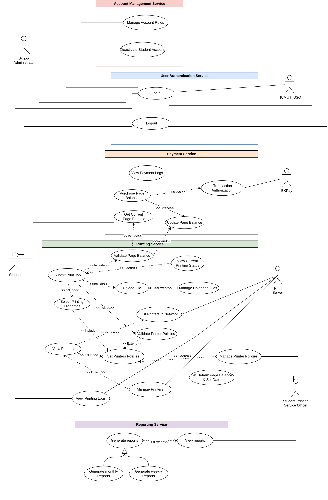

# Requirement

## Domain Context of a Smart Printing Service for Students at HCMUT

### Domain Context

The domain context of the smart printing service for students at HCMUT is to provide efficient and convenient printing services to students at Ho Chi Minh City University of Technology (HCMUT). In the modern educational landscape, students often require printed academic materials, assignments, and project reports. This service's objective is to simplify the printing process, improve accessibility, and allocate resources more cost-effectively. As the university places greater importance on digitalization and sustainability, HCMUT-SSPS aligns with its commitment to providing innovative solutions to its students.

### Stakeholders and their Current Needs

- **HCMUT Students**: Need to easily print documents from a web and mobile app on campus, choose printers based on preferences and requirements, and view printing history and page balance.
- **Student Printing Service Officer (SPSO)**: Need to manage printers, configure system settings, view history logs within a specific time period and for certain printers, and generate monthly/yearly reports.
- **HCMUT Administration**: Need to provide an effective printing service while managing resources efficiently and assessing usage trends for future planning.
- **HCMUT IT Department**: Need to ensure secure setup in the university network and integration with HCMUT_SSO authentication service and BKPay system.

### Benefits of HCMUT-SSPS for Each Stakeholder

- **Students**: Convenient and accessible printing within the university, easy track of print history and expense, seamless integration with online payment systems.
- **SSPSO**: Streamlined printer management and configuration processes, visibility into student printing activities for monitoring and abuse prevention.
- **Administration**: Effective and efficient printing service enhancing university reputation, access to data-driven insights for decision making related to service development.

## Functional and Non-Functional Requirements

### For Students

#### a. Functional Requirements

- Print a document by uploading a file, choosing a printer, specifying printing properties like paper size, pages to be printed, one-/double-sided, number of copies.
- View printing log with details like printed time, number of pages printed, printer name.
- Log in using HCMUT_SSO authentication service; service is inaccessible without login.
- Pay using BKPay for more page balance, with immediate reflection in the app.
- Disable printing ability when page balance is used up, with an option to purchase more balance.

#### b. Non-Functional Requirements

- Uploaded file accessibility restricted to the student or SPSO.
- User interface loading time under 5 seconds.
- Server availability during 50 concurrent uploads.
- Accurate page count.
- Rate limiting after initiating more than 5 print sessions within a short period to prevent abuse.

### For Student Printing Service Officer

#### a. Functional Requirements

- View and modify printing history (log) for all students or a specific student for a time period and for all or some printers.
- Modify system configuration, including default page count, file types accepted, etc.
- Add/enable/disable printers from the application.
- Access user information like balance, name, student ID.
- Generate and store monthly/yearly reports about usage statistics.

#### b. Non-Functional Requirements

- Include a comprehensive document detailing system operation.
- Apply configuration changes to all printers across the network within 1 minute.

### For HCMUT Administrator

#### a. Functional Requirements

- Create/redefine any account.
- Store and access payment history of each student.
- Deactivate/delete any student or SSPO account.
- View monthly/yearly reports on service usage.

#### b. Non-Functional Requirements

- Account changes by the administrator to be executed within 10 minutes.
- Notification to the administrator for system abuse (more than 5 printing sessions within a minute).

## Use-case Diagram

## Use-cases Table

### a. Printing Service

#### Use-case: Submit Print Job

- **Actor**: Student, Print Server
- **Description**: Send the request to the print server for printing after complete validation.
- **Trigger**: Users click the "Submit" button.
- **Precondition**: User is logged in; current printing status does not violate page balance or printer policies.
- **Steps**:
  1. Choose an enabled printer around the campus.
  2. Upload materials for printing.
  3. Check if printing status adheres to page balance and printer policies.
  4. Send print job to Print Server.
- **Postconditions**: Printing status stored in the system.
- **Exception Flow**: Handle violations in page balance or printer policies.

#### Use-case: View Printers

- **Actor**: Student, Print Server
- **Description**: View all available printers and their printing properties/options.
- **Trigger**: Users click on the “View printers” tab.
- **Precondition**: User is logged in; printer server is online.
- **Steps**:
  1. List all Printers in Network.
  2. Get all Printer Policies.
  3. Map printer policies with corresponding printer information and display to user.
- **Postconditions**: None.
- **Exception Flow**: None.

#### Use-case: View Printing Logs

- **Actor**: Student, Print Server
- **Description**: Summarize printing history for students and printers.
- **Trigger**: Users click on the “Print History” tab.
- **Precondition**: User is logged in; printer server is online.
- **Steps**:
  1. Fetch Printing Logs from Print Server.
  2. Filter logs based on user role (Student or Student Printing Service Officer).
- **Postconditions**: None.
- **Exception Flow**: None.

#### Use-case: Manage Printer Policies

- **Actor**: Student Printing Service Officer
- **Description**: Manage system configuration.
- **Trigger**: Administration changes.
- **Precondition**: Agreement by all actors for efficiency improvement.
- **Steps**:
  1. Access the system as an administrator.
  2. Make changes.
  3. Confirm the changes.
- **Postconditions**: Notify users of the changes.
- **Exception Flow**: None.

### b. User Authentication Service

#### Use-case: Login

- **Actor**: HCMUT_SSO, Student, Student Printing Service Officer, School Administrator
- **Description**: Provide system access for users.
- **Trigger**: Click “Login” button.
- **Precondition**: System running; user's database authenticated; HCMUT_SSO service online.
- **Exception Flow**: Incorrect username and password combination.

#### Use-case: Logout

- **Actor**: HCMUT_SSO, Student, Student Printing Service Officer, School Administrator
- **Description**: Log users out of the system.
- **Trigger**: Click “Logout” button.
- **Precondition**: System running; user currently logged in.

### c. Payment Service

#### Use-case: View Payment Logs

- **Actor**: School Administrator
- **Description**: Display Payment logs of users.
- **Trigger**: Click the “View Payment Logs” button.
- **Precondition**: System running.

#### Use-case: Purchase Page Balance

- **Actor**: Student
- **Description**: Update Page Balance after transaction authentication.
- **Trigger**: Click the “Purchase Page Balance” button.
- **Precondition**: System running; user logged in.
- **Extend**: Update Page Balance.
- **Include**: Transaction authentication.

#### Use-case: Update Page Balance

- **Actor**: None
- **Description**: Update user's Page Balance.
- **Trigger**: Authentication of user’s transaction.
- **Precondition**: System running; user logged in; transaction verification completed.

#### Use-case: Transaction Authorization

- **Actor**: BKPay
- **Description**: Authorize the transaction.
- **Trigger**: “Purchase Page Balance” use-case triggered.
- **Precondition**: System running; user logged in.

### d. Reporting Service

#### Use-case: View Reports

- **Actor**: Student Printing Service Officer
- **Description**: Provide reports to the Officer.
- **Trigger**: Click the “View Reports” button.
- **Precondition**: System running; database connected; Officer logged in.
- **Extend**: Generate Reports.

#### Use-case: Generate Reports

- **Actor**: None
- **Description**: Generate and store monthly/weekly reports in the database.
- **Trigger**: Monthly and Weekly Cron-job.
- **Precondition**: Print Server online.
